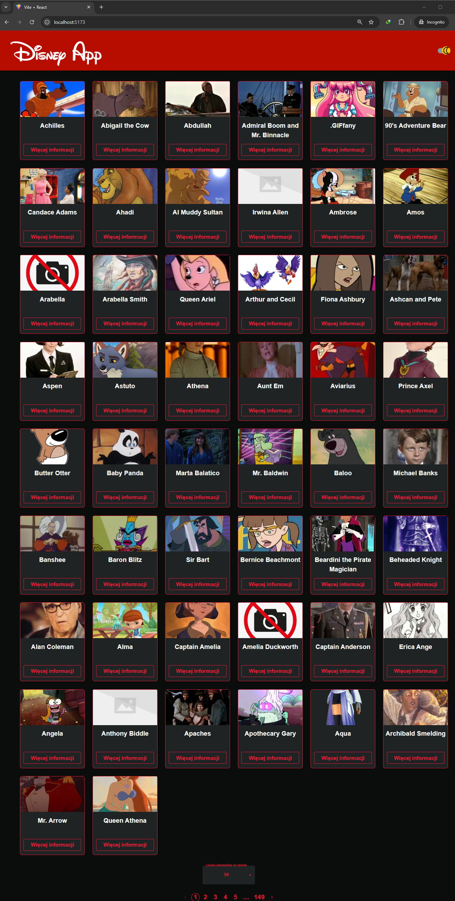
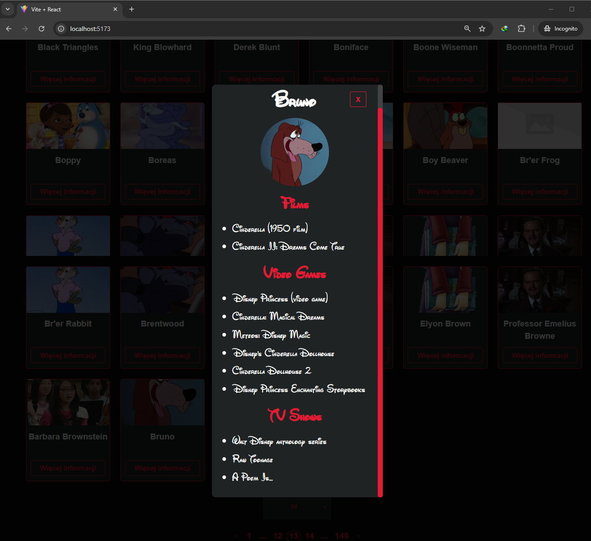

# Disney APP (data from external API)

## Application made with React + VITE

This project is an example that was built along the React course. 




DEMO: https://krzysztof-kryczka.github.io/disney-app/

## Installation

To run the application locally, follow these steps:

1. Clone the repository:

   ```bash
   git clone [repository-url]
   ```

2. Change to the project directory:
   ```bash
   cd [repository-name]
   ```

3. Install and start dependencies:
   ```bash
   npm install
   npm run dev
   ```

These commands install node modules and run an application along.

The application should now be accessible in your web browser at
http://localhost:5173/.

Used:
- fetch API
- styled-components
- material UI components
- reactHooks (useState, useEffect, useContext)
- customHooks (useGetData, useThemeContext)
- createPortal
